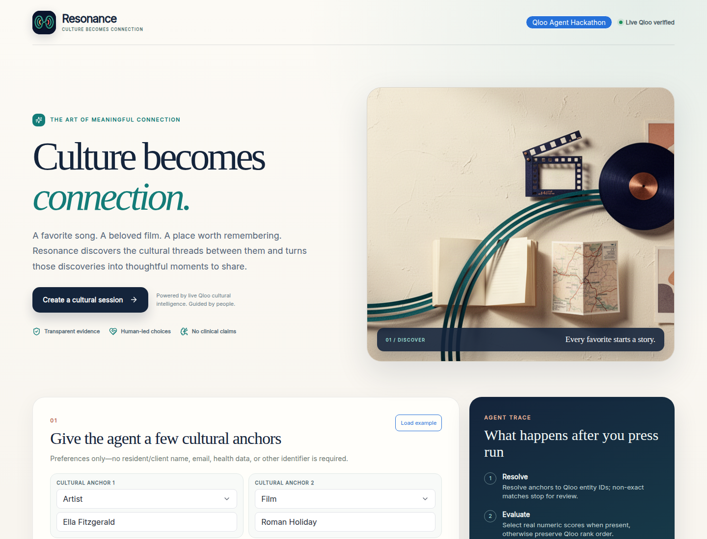
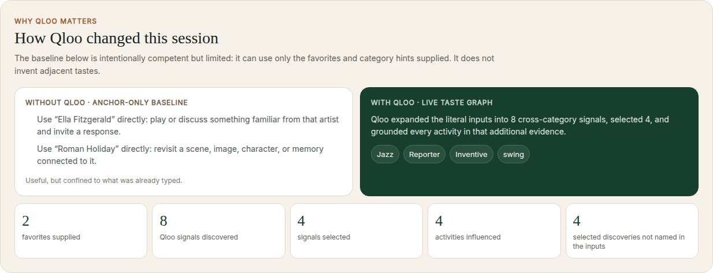
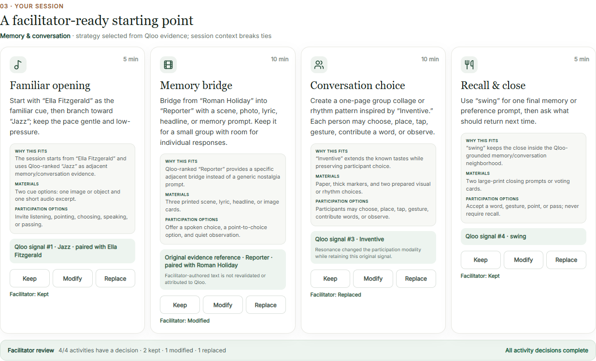

# Resonance

[](https://github.com/P00NSMASHER/resonance-qloo/actions/workflows/ci.yml)

**Qloo-powered cultural intelligence for more personal human connection.**

### Resonance Cultural Atlas identity

**Culture becomes connection.** The public web app now uses an original wave-connection emblem, editorial cultural artwork, a midnight-ink and peacock-teal design system, and a responsive hero leading directly to the functional Qloo session builder.

- [Editable Resonance identity board in Canva](https://www.canva.com/d/qpfmNH8wxTS5pH_)
- [Visual identity specification and asset provenance](docs/BRAND_IDENTITY.md)
- The work is a visual/design improvement, not a claim of improved resident outcomes or a replacement for real-user study results.

Live demo: https://resonance-qloo.floot.app  
Devpost: https://devpost.com/software/resonance-nud9ek

## Current judge gallery (permanent)

The published product has been recaptured in desktop and iPhone browser sessions, with the actual live Qloo comparison and facilitator controls. All seven images are now **committed directly to this public repository**; they do not depend on GitHub Actions' seven-day artifact retention.

- [Full screenshot gallery, capture metadata and SHA-256 hashes](docs/judge-gallery/README.md)
- [Desktop Cultural Atlas identity](docs/judge-gallery/00-brand-desktop.png)
- [iPhone-sized responsive homepage](docs/judge-gallery/00-brand-iphone.png)
- [Live-input screen](docs/judge-gallery/01-input.png)
- [Actual Qloo versus anchor-only comparison](docs/judge-gallery/02-qloo-transformation.png)
- [Four activities with completed facilitator review](docs/judge-gallery/03-finished-session.png)
- [Voluntary research study, desktop](docs/judge-gallery/04-study-desktop.png)
- [Voluntary research study, iPhone](docs/judge-gallery/04-study-iphone.png)







Resonance turns a handful of known cultural favorites—an artist, film, restaurant, brand, book, or place—into a culturally coherent 30-, 45-, or 60-minute engagement plan for senior-living activity teams and families.

## Facilitator-ready activity instructions

The current live Qloo agent turns each selected cultural signal into a concrete optional facilitator cue: a practical material or audio alternative, an exact question to ask, and permission to answer verbally, nonverbally, or not at all. For example, soundtrack suggests a short properly licensed audio excerpt; Art suggests two high-contrast pictures; a 60s signal suggests period imagery without assuming that the person lived through that decade.

These deterministic activity suggestions are **not** Qloo assertions about a participant or evidence that the suggested activities improve outcomes. Staff must choose appropriate materials and retain final control. Historical benchmark findings and zero validated human study responses are not rewritten.

## Why Qloo is essential

A generic LLM can generate plausible activities, but it cannot reliably ground those ideas in structured cross-category cultural affinities. Resonance uses Qloo evidence as the core signal, then runs an explicit agent loop:

1. resolve cultural anchors;
2. evaluate evidence strength;
3. select verified, activity-relevant genre affinities with transparent category-rank interleaving;
4. adapt the session to the chosen energy and setting;
5. expose the decision trace and explain every recommendation.

If Qloo returns too little reliable evidence, the agent fails closed instead of fabricating confidence.

### Category-aware resolution

Each anchor can optionally include a Qloo entity category such as Artist, Film, Book, Brand, Destination, Place, Podcast, TV Show, or Video Game. Resonance passes that hint through Qloo's documented `types` search parameter to reduce ambiguous matches. The chosen category is retained on the resolved-anchor evidence and counted in the agent trace, so judges can see when disambiguation was applied.

Independent anchor lookups run concurrently, reducing live latency without increasing the number of Qloo calls.

Resolved entities are also classified as either an **exact normalized-name match** or a **Qloo top-result match to review**. The UI does not turn that into a made-up confidence score. If a top result is non-exact, Resonance stops **before taste analysis**, shows the input → Qloo entity mapping, and returns a five-minute server-issued review receipt. The follow-up must include both the exact reviewed Qloo entity IDs and that receipt; IDs alone are insufficient. The receipt is HMAC-bound to the normalized anchors/category hints, energy, setting, duration, and reviewed IDs; its signing key is also derived from the Qloo credential, Qloo API origin, and shared deployment-contract version. An edited request, expired receipt, changed Qloo match, credential/origin rotation, or deployment-contract change therefore requires review again.

### Activity-relevant genre evidence

The new live session engine requests Qloo's `urn:tag:genre:music` and `urn:tag:genre:media` tag families. The agent preserves real returned values and interleaves the two separately ranked families; it cannot treat their individual numeric affinity scores as one global confidence scale. This removes generic price/star tags from the activity-planning flow without manufacturing replacement signals. The older unfiltered test artifacts are retained as historical reproducibility evidence.

### Qloo-native explainability

Taste analysis requests `feature.explainability=true`. Resonance does not assume or reinterpret Qloo's attribution schema: it records only whether Qloo actually returned non-empty per-result or aggregate `query.explainability` metadata. The live evidence panel shows that availability, while absent metadata stays absent rather than being simulated.

If Qloo returns HTTP 400/422 and the response detail specifically identifies the optional explainability feature as unsupported, Resonance retries the same bounded taste-analysis request once without that flag. Unrelated 400/422 validation failures are not retried or reinterpreted as an explainability compatibility issue.

## Live-mode truthfulness

A configured secret is **not** treated as proof that Qloo works.

`GET /api/status` now distinguishes:

- `preview` — no event credential is configured;
- `ready` — the credential is configured **and verified against Qloo**;
- `degraded` — a credential is configured but cannot be verified;
- `rate-limited` — verification is temporarily blocked by Qloo's rate limit.

The live button only becomes available in the verified `ready` state. This prevents the demo from advertising a live integration merely because an environment variable exists. Live status and recommendation provenance also expose the non-secret Qloo API origin so the event gateway can be audited without exposing the credential.

If the browser is `degraded` or `rate-limited`, the UI exposes **Retry Qloo verification**. Preview/no-credential mode does not show a retry control. That button calls `GET /api/status?refresh=1`, which rate-limitedly invalidates **any** cached probe—including a previously healthy `ready` result—and performs a fresh Qloo verification. Ordinary status reads still use the cache. Forced retries are separately capped at two per client per minute and twenty per server process per minute.

A later live recommendation can also invalidate the optimistic connection display: upstream Qloo rate limiting moves the UI to `rate-limited`, upstream 502/504 failures move it to `degraded`, and a malformed/inconsistent supposedly-live response also fails closed to `degraded`. Local public-demo throttling and valid “insufficient evidence” responses do **not** downgrade the Qloo connection state.

The server echoes a normalized `requestContext` receipt on both the HTTP 409 entity-review response and the final HTTP 200 recommendation: submitted anchors (with normalized Qloo type URNs when supplied), energy, setting, and duration. The browser refuses to show either a review card or **LIVE QLOO** unless that receipt exactly matches the form that initiated the request. Successful results must also be internally consistent, their resolved anchors/category hints must be an ordered subset of that receipt, and provenance must declare `qloo-live`, include a valid generation timestamp, and report the exact same Qloo API origin returned by the verified status endpoint. The receipt is visible in result metadata and preserved in copied/live evidence. Session-defining inputs are locked while a live request is in flight, and changing an anchor, category, energy, setting, or duration invalidates any prior result and pending entity confirmation so stale evidence cannot appear to belong to edited inputs.

## 60-second judge path

1. Open the live demo.
2. Check the connection indicator in the header.
3. The received event credential is now connected and verified in Floot. **Preview with example data** remains an explicitly labeled **ILLUSTRATIVE DEMO** fallback when live Qloo is temporarily unavailable.
4. Once Qloo is verified, enter 2–4 cultural favorites and run the live agent.
5. Read the default result in this order:
   - **Your favorites** — the resolved cultural anchors,
   - **What Qloo discovered** — the selected adjacent taste signals,
   - **Your session** — the four facilitator-ready activities,
   - **How Qloo changed this session** — a competent anchor-only baseline beside the Qloo-grounded result, with counts for returned signals, selected signals, influenced activities, and selected discoveries not literally named in the inputs.
6. Open **View evidence & audit trail** only when you want UUIDs, request receipt, provenance, contract version, all retained signals, review classifications, explainability metadata, selection rule, and the agent trace.

See [docs/JUDGING.md](docs/JUDGING.md) for a criterion-by-criterion walkthrough.

## Canonical judge example

Ten historical live candidate outputs were scored as whole results without filtering awkward signals. **Ella Fitzgerald + Roman Holiday** remains the default judge input because it produced the highest historical score (95.0/100). These historical unfiltered artifacts remain intact under `docs/DEMO_CASE_AUDIT.*` and `docs/CANONICAL_DEMO_EVIDENCE.json`; they are not claimed to be identical to the newer genre-filtered Qloo response.

## Why Qloo changes the result

The judge-facing comparison now uses the same submitted favorites on both sides. The anchor-only baseline is deterministic and may only reuse literal favorites/category hints; it cannot invent adjacent cultural signals. The Qloo side uses the actual returned taste graph evidence. This makes the incremental contribution inspectable instead of asserting that Qloo matters.

## Official Qloo event-tooling proof

The Qloo starter kit lists `qloo mcp` as a supported event surface. Resonance includes a redaction-safe verification script:

```bash
npm install --global @qloo/qloo-harness
qloo --version # must be 0.1.26 or newer for the current event kit
qloo setup --qloo
npm run qloo:proof -- "classic jazz vocals"
```

The script:

- starts the canonical `qloo mcp` server,
- checks `qloo_capabilities`,
- verifies `qloo_find_tags` is available,
- runs a bounded request,
- redacts credential-like fields,
- prints a request-to-result artifact suitable for submission evidence.

The real event key must never be committed or pasted into a public artifact.

## Current hackathon status

- Resonance is formally **Submitted** to the Qloo Agentic Hackathon; the Devpost project record reports `submitted_at: 2026-10-02T08:25:09.325-04:00`. The submission remains editable while the window is open.
- Public live demo is deployed on Floot. GitHub `main` is the source of truth; after source changes, republish the Floot app before final judging so the public demo matches the reviewed head.
- Public MIT-licensed source repo is complete and GitHub recognizes the MIT license.
- Direct npm dependencies are pinned, `package-lock.json` is committed, and CI installs with `npm ci` before typecheck, tests, production build, smoke/self-tests, submission preflight, and the advisory public deployment parity check.
- OpenAPI 3.1 contract, submission evidence, known limitations, and finalization runbook are public.
- The event-issued Qloo credential is connected to the Floot production environment and has passed a forced public readiness probe: `mode=live`, `qlooStatus=ready`, `qlooConfigured=true`, `qlooConnected=true`.
- Public live-Qloo execution is verified end-to-end for both the exact-match path and the non-exact review-gated path. The exact-match artifact records 2 resolved Qloo entities, 8 returned affinities, 4 selected signals, and a 4-step `qloo-live` plan. The review-gated artifact records HTTP 409 before taste analysis, one signed confirmed top-result match, then a successful HTTP 200 `qloo-live` plan with 3 resolved entities.
- The exact judge-facing Floot runtime source is committed under `floot-production/` with project version `1791168430799`, content-addressed file identities, and `npm run floot:production:parity` to verify Qloo/review/cache/provenance/UI/study invariants against the canonical implementation.
- Formal submission is complete, and the current judge-readiness checks are verified: live Qloo evidence covers both exact-match and signed review-gated flows, and public Floot deployment parity passes. The anonymous target-user validation study is open and data-collection ready, but currently has 0 valid responses; no participant-derived outcomes are claimed.
- The study’s open comment is never written to production logs. Each participant receives a complete anonymous JSON receipt to hand directly to the facilitator; only received and validated receipts can enter the analysis workflow.

## First real-user pilot

The [voluntary facilitator kit](docs/FIRST_PILOT_FACILITATOR_KIT.md) documents participant instructions, receipt handoff and private eligibility review. Neither the anonymous receipt analyzer nor the older impact CSV script publishes aggregate statistics without 3–5 reconciled facilitator-reviewed real participant records. These safeguards are operational review requirements, not cryptographic proof of participant identity. No real-user impact claim is made yet.

## Evidence and reproducibility

- [Submission evidence](docs/SUBMISSION_EVIDENCE.md)
- [Known limitations](docs/KNOWN_LIMITATIONS.md)
- [Architecture](docs/ARCHITECTURE.md)
- [Judge guide](docs/JUDGING.md)
- [Finalization runbook](docs/FINALIZATION_RUNBOOK.md)
- [Floot live-Qloo cutover](docs/FLOOT_QLOO_CUTOVER.md)
- [Verified live Qloo evidence](docs/LIVE_QLOO_EVIDENCE.json)
- [Verified review-gated Qloo evidence](docs/LIVE_QLOO_REVIEW_EVIDENCE.json)
- [Canonical demo-case audit](docs/DEMO_CASE_AUDIT.md)
- [Canonical demo evidence](docs/CANONICAL_DEMO_EVIDENCE.json)
- [Exact Floot production source](floot-production/README.md)
- [Security](SECURITY.md)
- [OpenAPI contract](openapi.yaml)

## Tech

- React 19
- TypeScript
- Vite
- Node.js 22.19+
- Qloo Search + Insights integration against the event hackathon API origin
- verified-Qloo status probe
- Official Qloo MCP proof path
- Vitest
- GitHub Actions

## Local setup

```bash
git clone https://github.com/P00NSMASHER/resonance-qloo.git
cd resonance-qloo
npm ci
cp .env.example .env
```

Add the **event-issued** Qloo key to `.env`. Hackathon keys only work against the event API origin, so keep both values:

```env
QLOO_API_KEY=your_event_key_here
QLOO_API_BASE_URL=https://hackathon.api.qloo.com
```

Never commit the real key. Resonance defaults to the hackathon origin and only accepts explicitly allowlisted Qloo API hosts. If Qloo introduces another organizer-approved gateway, add that host to the reviewed server allowlist and tests before using it; do not bypass the origin check with an arbitrary URL.

Run the API server:

```bash
npm run dev:server
```

In a second terminal:

```bash
npm run dev:web
```

Open http://localhost:5173.

## Verify

Run the full offline repository verification in one command:

```bash
npm run verify:offline
```

That command covers exact Floot production-source parity, typecheck, unit tests, production build, preview/live-handshake smoke tests, deployment-checker self-tests, MCP-proof redaction self-tests, evidence-capture self-tests, and offline submission preflight.

After connecting or rotating the event key, run the cross-platform cutover check:

```bash
npm run qloo:cutover:verify
```

That command first runs `deployment:check`, then forces a fresh Qloo verification with `qloo:live:check -- --refresh`. For normal later readiness checks, use `npm run qloo:live:check` without forcing another probe.

`deployment:check` answers **“is the published frontend/backend current?”**. `qloo:live:check` separately answers **“has the public app verified the event-issued Qloo credential?”** and only passes when status is `mode=live`, `qlooStatus=ready`, `qlooConfigured=true`, and `qlooConnected=true`.

`deployment:check` verifies both sides of the public Floot deployment. The backend `/api/status` and frontend bundle must both carry the exact shared version from `deployment-contract.json`; the status endpoint must also expose the Resonance service contract and `https://hackathon.api.qloo.com` origin, and the public bundle must contain the current judge-evidence UI markers. A reachable but stale or mixed-version frontend/backend therefore fails the check.

The smoke test verifies:

- preview status when no key is connected,
- HTTP 503 fail-closed behavior for live requests without a key,
- HTTP 404 for unknown API routes,
- a local HTTPS Qloo-backed live status probe,
- HTTP 409 before a non-exact Qloo top match is confirmed,
- zero taste-analysis calls before confirmation,
- HTTP 200 after the exact returned Qloo entity ID is confirmed,
- truthful reuse of the third selected signal when only three usable Qloo signals are returned.

## API

`GET /api/status` verifies whether Qloo is actually usable before reporting `ready`.

`POST /api/recommend` accepts:

```json
{
  "anchors": [
    {"query":"Aretha Franklin","type":"artist"},
    {"query":"The Sound of Music","type":"movie"}
  ],
  "energy": "calm",
  "setting": "small-group",
  "durationMinutes": 30
}
```

Invalid public requests fail closed with HTTP 400 before Qloo is contacted. The server does not silently truncate extra anchors, ignore unknown fields, or substitute defaults for invalid energy, setting, duration, or confirmation IDs.

A successful live response includes:

- resolved Qloo anchors, category hints, and exact-name vs top-result classification,
- a review-required handshake before non-exact top results can be used for taste analysis,
- affinity labels plus Qloo-provided scores when present, otherwise ranked result order,
- first-class returned-versus-selected affinity counts,
- numbered selected signals preserved from evidence into plan steps and exports,
- returned-but-unselected signals retained as additional evidence,
- a four-part session,
- selectable 30-, 45-, or 60-minute timeboxing,
- per-step rationale,
- an agent decision trace,
- an evidence summary.

## Privacy and scope

- Use cultural entities/preferences only; do not send resident/client names, emails, account IDs, device identifiers, health information, location histories, or other personal data to Qloo.
- A public cultural entity may itself contain a person's name (for example, a favorite artist); that is distinct from identifying the person using the product.
- Resonance is not a medical tool and gives no medical advice.
- Qloo results are treated as aggregate cultural-affinity signals, not claims about identity, sensitive traits, causality, probability, or future behavior for an individual.
- Human facilitators remain in control of final activity choices.

## License

MIT — see [LICENSE](./LICENSE).
